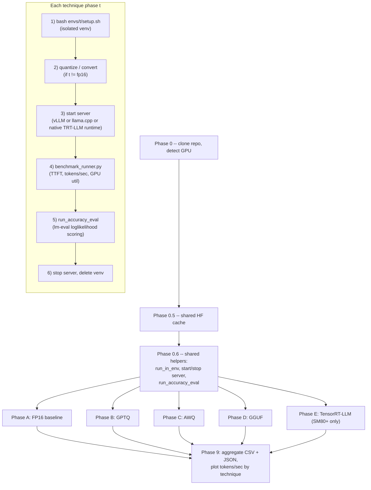
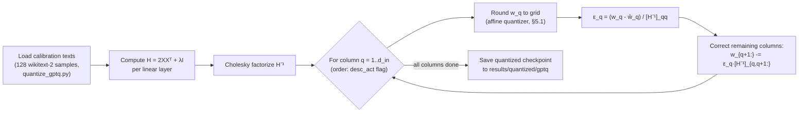
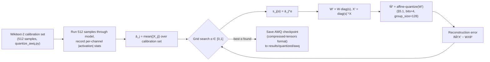
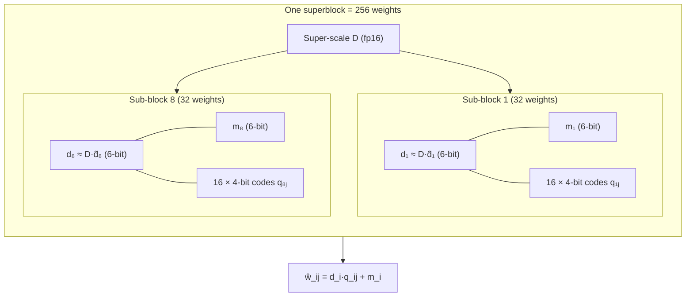
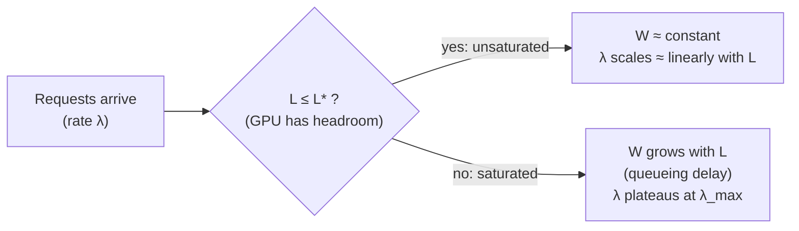
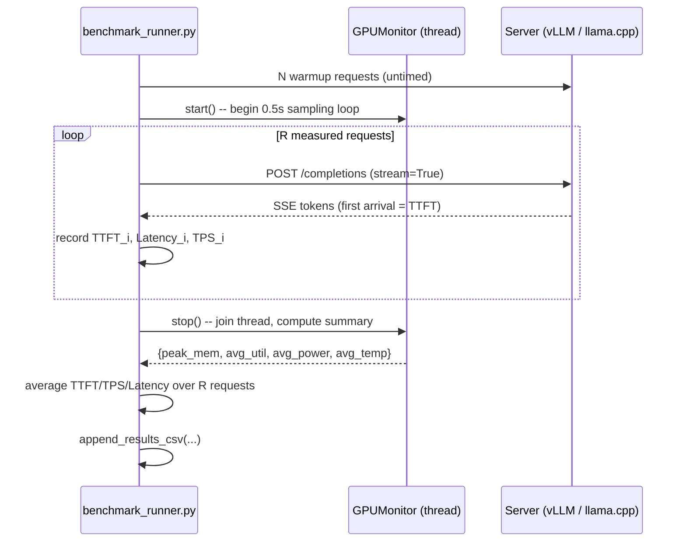
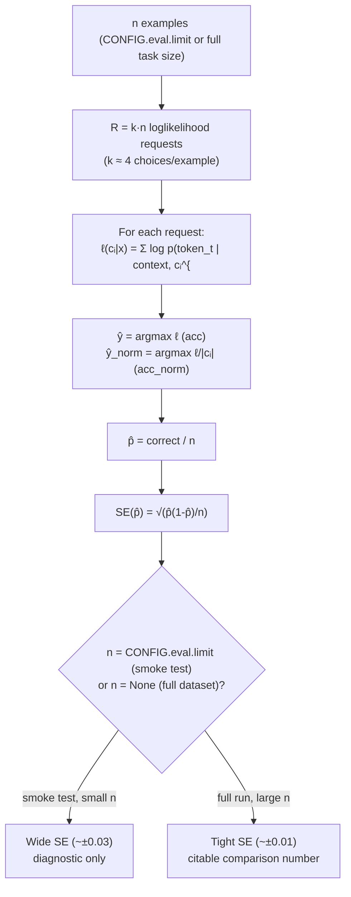
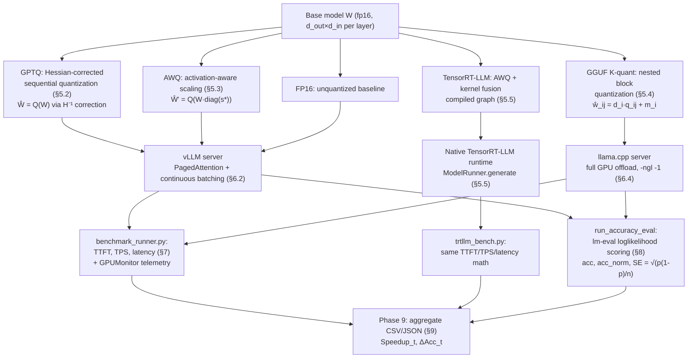

# Mathematical Foundations of the LLM Inference Benchmark Suite

## 1. How to read this document

Every section below has the same two-layer structure:

- **🟢 Plain-language box** — what is happening and why, with no equations, aimed at a reader who has never seen a quantization paper.
- **🔵 Formal derivation** — the actual mathematics: notation, formulas, and — where relevant — the exact place in the codebase that implements each symbol.

Where a mermaid diagram helps, one is included immediately after the relevant derivation. Every external algorithm (GPTQ, AWQ, GGUF k-quants, PagedAttention, lm-eval's scoring rule) is cited to its primary source so you can verify the math independently of this document.

---

## 2. System overview

🟢 **Plain language.** The repository takes one language model (Qwen2.5-3B-Instruct) and serves it five different ways — full precision, and four compressed ("quantized") variants — then races them against each other on speed, memory, and how much accuracy each shortcut costs. Because the five techniques need mutually incompatible software versions, each one lives in its own sealed Python environment and is invoked as a subprocess.

🔵 **Formal statement.** Let $\mathcal{T} = \{\text{fp16}, \text{gptq}, \text{awq}, \text{gguf}, \text{trtllm}\}$ be the set of techniques. For each $t \in \mathcal{T}$ the pipeline computes a tuple of measured quantities

$$
R_t = \big(\text{TTFT}_t,\ \text{TPS}_t,\ \text{Lat}_t,\ \text{VRAM}_t,\ \text{Acc}_t,\ \text{Size}_t\big)
$$

(time-to-first-token, tokens/second, end-to-end latency, peak VRAM, task accuracy, checkpoint size on disk), and the final deliverable is the comparison $\{R_t\}_{t\in\mathcal{T}}$, aggregated in `results/benchmark_results.csv` (Phase 9, `notebooks/llm_inference_benchmark_colab.ipynb`).



---

## 3. Notation used throughout

| Symbol                                    | Meaning                                            | Where it appears in code                          |
| ----------------------------------------- | -------------------------------------------------- | ------------------------------------------------- |
| $W \in \mathbb{R}^{d_{out}\times d_{in}}$ | A linear layer's weight matrix                     | every quantization script                         |
| $X \in \mathbb{R}^{d_{in}\times n}$       | Calibration activations, $n$ calibration samples   | `quantize_gptq.py`, `quantize_awq.py`             |
| $b$                                       | Bits per quantized weight                          | `CONFIG.gptq.bits`, `CONFIG.awq.bits`             |
| $g$                                       | Group size (weights sharing one scale)             | `CONFIG.gptq.group_size`, `CONFIG.awq.group_size` |
| $s, z$                                    | Quantization scale, zero-point                     | affine quantizer (§5.1)                           |
| $H$                                       | Layer-wise Hessian proxy, $H = 2XX^\top$           | GPTQ (§5.2)                                       |
| $L_{max}$                                 | `CONFIG.model.max_model_len`                       | `config.py`                                       |
| $\mu$                                     | `gpu_memory_utilization`                           | `config.py`, `server_utils.py`                    |
| $c$                                       | `num_concurrent` (lm-eval) / concurrent requests   | notebook `run_accuracy_eval`                      |
| $n$                                       | number of evaluation samples (`CONFIG.eval.limit`) | `config.py`                                       |
| $p$                                       | measured accuracy (a proportion)                   | lm-eval output                                    |

---

## 4. Configuration and GPU memory budget mathematics

🟢 **Plain language.** A GPU only has so much memory. Some of it holds the model's weights, and the rest is used as a scratchpad ("KV cache") that grows with how many requests are being handled at once and how long each conversation is allowed to get. `config.py`'s own comments already state the key trade-off: doubling the maximum context length roughly halves how many requests can run at the same time. Here is the arithmetic behind that claim.

🔵 **Formal derivation.**

The KV cache stores one key vector and one value vector per attention layer, per attention head (or per KV-head under grouped-query attention), per token. For a transformer with $n_{layer}$ layers, $n_{kv}$ KV-heads, head dimension $d_{head}$, and cache storage dtype of $\beta$ bytes (2 for fp16/bf16):

$$
m_{kv} \;=\; \underbrace{2}_{\text{K and V}} \times n_{layer} \times n_{kv} \times d_{head} \times \beta \quad \text{[bytes / token]}
$$

Given total GPU memory $M_{total}$, the fraction reserved by vLLM is $\mu = $ `gpu_memory_utilization` (`CONFIG.server.gpu_memory_utilization = 0.90`). After subtracting model weights $M_{weights}$ and fixed engine overhead $M_{ovh}$ (CUDA context, activation buffers), the memory available for the KV cache is

$$
M_{budget} \;=\; \mu \cdot M_{total} \;-\; M_{weights} \;-\; M_{ovh}
$$

With every concurrent sequence permitted to grow up to `CONFIG.model.max_model_len` $= L_{max}$ tokens, the maximum number of sequences $N_{seq}$ that fit **simultaneously** at full context length is

$$
N_{seq} \;\approx\; \left\lfloor \frac{M_{budget}}{L_{max}\cdot m_{kv}} \right\rfloor
$$

This is exactly a hyperbola in $L_{max}$: since $M_{budget}$ and $m_{kv}$ are fixed at a given $\mu$,

$$
N_{seq}(L_{max}) \;\propto\; \frac{1}{L_{max}} \quad\Longrightarrow\quad N_{seq}(2L_{max}) \;=\; \tfrac{1}{2}\,N_{seq}(L_{max})
$$

which is precisely the "every doubling of `max_model_len` roughly halves concurrent capacity" statement documented in `config.py`. In practice vLLM does not pre-reserve $L_{max}$ tokens per sequence up-front (see §6.2, PagedAttention) — but this "reserved-capacity" bound is still the correct **upper limit** on total concurrent tokens the KV cache can ever hold, since the paging mechanism only affects _fragmentation_, not the _total_ bytes required to hold a given number of live tokens.

Raising $\mu \to 1$ shrinks the OOM safety margin $M_{total}(1-\mu)$ toward the fixed CUDA/driver overhead floor, explaining the comment that $\mu=0.90$ can need to drop to $0.85$ on tighter models.

---

## 5. Quantization mathematics

### 5.1 The universal affine quantizer

🟢 **Plain language.** Quantization means replacing each 16-bit floating-point weight with a small integer (e.g. 0–15 for 4-bit) plus one shared "translation key" (a scale, and sometimes an offset) that lets you approximately reconstruct the original number later. Weights are split into small groups so that the translation key can adapt locally instead of being forced to cover the model's entire numeric range at once.

🔵 **Formal derivation.** For a group of $g$ weights (`group_size`, e.g. 128) with $b$ bits (`bits`, e.g. 4), define the integer grid $\{0, 1, \dots, 2^b-1\}$.

**Asymmetric (zero-point) quantization** — used when `AWQConfig.zero_point = True`, i.e. `symmetric = not zero_point = False` (`src/quantize_awq.py`):

$$
s = \frac{w_{max}-w_{min}}{2^b-1}, \qquad z = \operatorname{round}\!\left(\frac{-w_{min}}{s}\right)
$$

$$
q = \operatorname{clip}\!\Big(\operatorname{round}\big(\tfrac{w}{s}\big) + z,\; 0,\; 2^b-1\Big), \qquad \hat w = s\,(q - z)
$$

**Symmetric quantization** (`zero_point = False`): $z=0$ and the grid is centered on zero,

$$
s = \frac{\max(|w|)}{2^{b-1}-1}, \qquad q = \operatorname{clip}\!\Big(\operatorname{round}\big(\tfrac{w}{s}\big),\; -(2^{b-1}-1),\; 2^{b-1}-1\Big), \qquad \hat w = s\,q
$$

The **quantization error** for any single weight is bounded by half the step size, $|\hat w - w| \le s/2$ — this single fact is the seed from which both GPTQ (§5.2) and AWQ (§5.3) derive their entire strategy, since they differ only in _how_ they try to make the effect of this bounded error on the model's output as small as possible.

**Compression ratio.** Original fp16 storage is $16$ bits/weight; a group of $g$ weights quantized at $b$ bits with one $16$-bit scale (+ $16$-bit zero-point if asymmetric) costs

$$
\text{bits/weight}_{eff} \;=\; b + \frac{16\,(1 + \mathbb{1}[\text{asymmetric}])}{g}
$$

For GPTQ/AWQ defaults ($b=4$, $g=128$, asymmetric): $4 + \frac{32}{128} = 4.25$ bits/weight, an **≈3.76×** shrink versus fp16.

---

### 5.2 GPTQ — Hessian-corrected sequential quantization

🟢 **Plain language.** Instead of rounding every weight independently (which lets small errors pile up), GPTQ quantizes one column of weights at a time and, immediately after rounding each one, nudges every _not-yet-quantized_ weight in the same row slightly to compensate for the error just introduced — using calibration data to know exactly how much each weight matters. It's like distributing rounding errors from a shared bill: once one person's share is rounded, you adjust everyone else's remaining shares so the total still comes out right.

🔵 **Formal derivation.** [GPTQ (Frantar et al., ICLR 2023)](https://arxiv.org/abs/2210.17323) poses, per output row $w \in \mathbb{R}^{1\times d_{in}}$ of $W$, the layer-wise reconstruction problem over calibration activations $X\in\mathbb{R}^{d_{in}\times n}$:

$$
\hat w \;=\; \arg\min_{\hat w} \; \| wX - \hat wX \|_2^2
$$

Its second derivative (the row-shared Hessian, since $X$ is identical for every row of $W$) is

$$
H \;=\; 2XX^\top \;+\; \lambda I \in \mathbb{R}^{d_{in}\times d_{in}}
$$

(the $\lambda I$ damping term, $\lambda \approx 0.01\cdot\overline{\operatorname{diag}(H)}$, keeps $H$ invertible on ill-conditioned calibration statistics). Building on Optimal Brain Compression, for each column index $q=1,\dots,d_{in}$ in a fixed order:

1. **Quantize** the weight at that column with the affine quantizer of §5.1: $\hat w_q = Q(w_q)$.
2. **Measure the error**: $\displaystyle \epsilon_q = \frac{w_q - \hat w_q}{[H^{-1}]_{qq}}$.
3. **Propagate the correction** to every still-unquantized weight in the row:
   $$
   w_{q+1:} \;\mathrel{-}=\; \epsilon_q \cdot [H^{-1}]_{q,\,q+1:}
   $$
4. Advance to column $q+1$.

Because $H$ is shared across all $d_{out}$ rows, GPTQ's efficiency contribution is computing the Cholesky factorization $H^{-1} = C^\top C$ **once** per layer and reusing it for every row and every subsequent column in a single left-to-right block pass, turning a naive $O(d_{in}^3)$-per-row procedure into an $O(d_{in}^2)$ amortized one.

`src/quantize_gptq.py` exposes exactly two knobs into this machinery via `GPTQModel.QuantizeConfig(bits, group_size, desc_act)`:

- `bits` $\to b$, `group_size` $\to g$ (§5.1),
- `desc_act` (activation order): reorders the column index $q$ by **decreasing** $\operatorname{diag}(H)_{qq}$ (i.e. quantize the columns whose activations have the largest average magnitude _first_, while the Hessian-based correction is least degraded by prior rounding). The repo sets `desc_act=False` — a documented speed/accuracy trade: descending-order columns break the contiguous-memory access pattern GPTQModel's CUDA dequant kernel relies on, at a marginal accuracy cost on a 3B model.



---

### 5.3 AWQ — activation-aware channel scaling

🟢 **Plain language.** AWQ starts from an observation: not every weight matters equally — the ones that get multiplied by large-magnitude activations matter much more to the model's output than the rest. Rather than giving those important weights extra bits (which hardware doesn't like), AWQ mathematically "scales them up" before rounding (making the rounding relatively gentler on them) and scales the corresponding activations back down by the exact same amount, so the final multiplication is unchanged — a free lunch that costs nothing at inference time.

🔵 **Formal derivation.** [AWQ (Lin et al., MLSys 2024)](https://arxiv.org/abs/2306.00978) begins from the linear-layer identity: for any positive per-input-channel scaling vector $s \in \mathbb{R}_{>0}^{d_{in}}$,

$$
y = Wx = \big(W\operatorname{diag}(s)\big)\big(\operatorname{diag}(s)^{-1}x\big) = W' x'
$$

Since activations $x'$ stay in full precision (this is weight-only quantization), only $W'$ needs to be quantized: $\hat W' = Q(W')$. Because the rounding error is bounded in **absolute** terms by $s_{\text{group}}/2$ (§5.1) but its **impact** on the output is $\propto x_j$, up-scaling the channels with large activation magnitude before quantizing shrinks the _relative_ error precisely where it would otherwise hurt the most.

AWQ measures "salience" directly from calibration activations, not from the weights themselves — the average magnitude of channel $j$ across the calibration set:

$$
\bar a_j \;=\; \frac{1}{n}\sum_{i=1}^n |X_{j,i}|
$$

and parametrizes the scale as $s_j = \bar a_j^{\,\alpha}$ for a single scalar $\alpha\in[0,1]$, found by a 1-D grid search that directly minimizes the _actual_ reconstruction error on calibration data:

$$
\alpha^\star \;=\; \arg\min_{\alpha}\; \Big\| Q\big(W\operatorname{diag}(s(\alpha))\big)\operatorname{diag}(s(\alpha))^{-1}X \;-\; WX \Big\|_2^2
$$

`src/quantize_awq.py` calls the vLLM project's actively-maintained `llm-compressor` (successor to the now-deprecated standalone `autoawq`), configuring the quantization scheme directly from `CONFIG.awq` fields:

```python
weight_args = QuantizationArgs(
    num_bits=awq_cfg.bits, symmetric=not awq_cfg.zero_point,
    strategy=QuantizationStrategy.GROUP, group_size=awq_cfg.group_size,
)
```

so `AWQConfig.bits`/`group_size` feed the same affine-quantizer parameters $b, g$ as §5.1, while `AWQModifier` performs the $\alpha^\star$ search internally using the same wikitext-2 calibration set as GPTQ (`build_calibration_dataset`, matched to `quantize_gptq.py`'s source for a controlled comparison).



---

### 5.4 GGUF / K-quants — nested block quantization

🟢 **Plain language.** llama.cpp's GGUF format doesn't use calibration data at all — it just groups weights into small blocks and, for each block, stores one small "translation key" (scale, and for some formats a minimum) alongside the rounded integers. `Q4_K_M` goes one level further: it groups 256 weights into a "superblock," splits that into eight 32-weight "sub-blocks," gives each sub-block its own scale/minimum — and then, because storing eight full-precision numbers per 256 weights would be wasteful, it quantizes _those_ scale/minimum values too, down to 6 bits each.

🔵 **Formal derivation.** For the `Q4_K_M` format produced by `src/convert_gguf.py`'s call to `llama-quantize`, each **superblock** of $256$ weights is partitioned into $8$ **sub-blocks** of $32$ weights. Sub-block $i$ has its own scale $d_i$ and minimum $m_i$, giving a two-parameter (not merely zero-centered) affine dequantizer per 32-weight group:

$$
\hat w_{i,j} \;=\; d_i \cdot q_{i,j} \;+\; m_i, \qquad q_{i,j} = \operatorname{clip}\!\left(\operatorname{round}\!\left(\frac{w_{i,j}-m_i}{d_i}\right),\,0,\,15\right) \in \{0,\dots,15\}
$$

Naively storing $d_i, m_i$ as two fp16 values per 32 weights would cost $\frac{2\times16}{32}=1$ extra bit/weight on top of the 4-bit codes. K-quants instead quantize the _eight_ $(d_i, m_i)$ pairs of a superblock **again**, this time to 6 bits each, relative to one shared fp16 "super-scale" $D$ for the whole 256-weight superblock:

$$
d_i \;\approx\; D\cdot \hat d_i,\qquad \hat d_i \in \{0,\dots,63\} \;\;(\text{6 bits})
$$

The resulting **effective bits-per-weight** for a block scheme storing $r$ bits of raw code plus $k$ scale-parameters of $c$ bits each per block of size $B$ is, in general,

$$
\text{bpw}_{eff} \;=\; r \;+\; \frac{k\cdot c}{B}
$$

For `Q8_0` (`CONFIG.gguf.quant_types` includes `"Q8_0"`): $r=8$, one fp16 scale ($c=16$) per block of $B=32$ $\Rightarrow$ bpw$_{eff}=8+\frac{16}{32}=8.5$. For `Q4_K_M`'s nested scheme, the widely reported effective rate is $\approx 4.5$ bits/weight (the extra $0.5$ over raw 4-bit coming from the two-level scale/min overhead above), which is why `Q4_K_M` occupies roughly $\frac{4.5}{16}\approx 28\%$ of the fp16 checkpoint size while `Q5_K_M` and `Q8_0` occupy roughly $34\%$ and $53\%$ respectively — see the [llama.cpp quantize README](https://github.com/ggml-org/llama.cpp/blob/master/tools/quantize/README.md) and the [GGUF format reference](https://huggingface.co/docs/hub/en/gguf) for the exact bit-packing layout.



`src/convert_gguf.py`'s pipeline is: `snapshot_download` → `convert_hf_to_gguf.py` (produces the lossless `model-f16.gguf`) → `llama-quantize` invoked once per entry of `CONFIG.gguf.quant_types` (`["Q4_K_M", "Q5_K_M", "Q8_0"]`), each pass applying the block scheme above independently to the same fp16 source tensor.

---

### 5.5 TensorRT-LLM engine build — compiled-graph AWQ

🟢 **Plain language.** TensorRT-LLM doesn't run Python at inference time at all — `trtllm-build` compiles the entire model into one fused, GPU-native execution graph ahead of time. When `use_awq=True`, the same activation-aware scaling math from §5.3 is applied to the weights before compilation, so the compiled graph natively runs 4-bit weights, without needing an extra Python dequantization step per layer.

🔵 **Formal derivation.** `src/build_trtllm_engine.py` first asserts a hardware precondition — SM major version $\ge 8$ (Ampere+) — because TensorRT-LLM's prebuilt INT4-AWQ CUDA kernels are only compiled for that instruction set:

$$
\text{major}(\text{sm}) \;\ge\; 8 \quad\Longleftrightarrow\quad \text{Ampere or newer}
$$

The build command applies the identical affine-quantization math of §5.1/§5.3 (`--quantization int4_awq`), but the _systems_-level mathematics that differentiates this phase from vLLM-served AWQ (Phase C) is **kernel fusion**: whereas an eager/vLLM execution graph launches one CUDA kernel per operator (LayerNorm, QKV projection, attention, output projection, MLP, …), `trtllm-build` fuses adjacent operators into fewer, larger kernels. Modeling total per-token decode latency as

$$
t_{decode} \;=\; \underbrace{\max\!\big(t_{compute},\,t_{mem\text{-}bw}\big)}_{\text{arithmetic / bandwidth bound}} \;+\; \underbrace{k \cdot t_{launch}}_{\text{kernel-launch overhead}}
$$

where $k$ is the number of distinct kernel launches per decode step and $t_{launch}$ is a fixed per-launch overhead (driver + scheduling cost, largely independent of tensor size), fusion reduces $k$ directly. This term is proportionally most significant at **small batch sizes** — exactly where `benchmark_runner.py`'s `batch_sizes = [1, 4, 8, 16, 32]` sweep starts (§6) — since $t_{compute}$ and $t_{mem\text{-}bw}$ scale with tensor size while $k\cdot t_{launch}$ does not, so the _fixed_ overhead term dominates relatively more when batch size (and thus tensor size) is small.

---

## 6. Serving mathematics

### 6.1 Autoregressive decoding recap

🟢 **Plain language.** An LLM produces one word-piece ("token") at a time; to produce the next token it needs to "remember" everything it produced before, which is what the KV cache stores so the model doesn't have to recompute the entire sentence from scratch on every single token.

🔵 **Formal statement.** For token position $t$, the model computes attention as

$$
\text{Attn}(Q_t, K_{\le t}, V_{\le t}) \;=\; \operatorname{softmax}\!\left(\frac{Q_t K_{\le t}^\top}{\sqrt{d_{head}}}\right) V_{\le t}
$$

Reusing $K_{\le t-1}, V_{\le t-1}$ from the cache instead of recomputing them from all prior tokens is what turns the naive $O(t^2)$-per-token cost of recomputation into $O(t)$ per new token — this is _why_ a KV cache exists at all, and its memory footprint is exactly $m_{kv}$ from §4, per token, per sequence.

### 6.2 PagedAttention and continuous batching (vLLM)

🟢 **Plain language.** Two problems plague naive LLM serving: (1) reserving a big contiguous memory block per request wastes space when the request finishes early (like reserving a whole hotel floor for a guest who leaves after one night), and (2) batching requests together the old way means the whole batch has to wait for its _slowest_ member to finish before any new request can be admitted. vLLM fixes (1) by chopping the KV cache into small fixed-size "pages" it can hand out and reclaim like an operating system's virtual memory, and fixes (2) by letting the scheduler add and remove individual requests from the running batch at every single decoding step, not just at batch boundaries.

🔵 **Formal statement.** [PagedAttention (Kwon et al., SOSP 2023)](https://arxiv.org/abs/2309.06180) partitions each sequence's KV cache into fixed-size logical blocks of $B_{page}$ tokens (analogous to OS memory pages), mapped to physical GPU memory blocks via a per-sequence block table $\Phi: \text{block\_id} \to \text{physical\_addr}$ — eliminating the internal fragmentation that a pre-reserved $L_{max}$-token contiguous allocation (§4's naive upper bound) would otherwise waste on every sequence shorter than $L_{max}$. `VLLMServer`/`start_vllm_server` (`src/vllm_server.py`, `src/server_utils.py`) expose this transparently through `--gpu-memory-utilization` ($\mu$) and `--max-model-len` ($L_{max}$); the paging itself is internal to vLLM's engine.

Continuous batching turns request admission from a per-_batch_ decision into a per-_decoding-step_ decision: at every step $\tau$, the scheduler solves

$$
\text{RunningBatch}(\tau) \;=\; \big(\text{RunningBatch}(\tau-1) \setminus \text{Finished}(\tau)\big) \;\cup\; \text{Admit}(\tau)
$$

subject to $\sum_{\text{seq} \in \text{RunningBatch}(\tau)} |\text{live KV blocks}| \le N_{seq}$ (§4's capacity bound). This keeps GPU occupancy near-constant instead of oscillating between "full batch" and "draining stragglers," which is the direct mathematical justification for `BenchmarkConfig.batch_sizes = [1, 4, 8, 16, 32]` sweeping into the regime (`config.py`'s own comment) "where vLLM's continuous batching and PagedAttention start to show throughput gains over naive batching."

### 6.3 Continuous batching throughput via Little's Law

🟢 **Plain language.** There's a beautifully simple relationship in queueing theory: on average, _(number of things being worked on at once) = (rate things arrive) × (average time each thing takes)_. Applied here: if you keep more requests "in flight" at the vLLM server, you get proportionally more finished-requests-per-second — but only up to the point where the GPU itself is the bottleneck, after which adding more in-flight requests just makes each one wait longer without actually finishing more per second.

🔵 **Formal statement.** [Little's Law](https://en.wikipedia.org/wiki/Little's_law) states, for any stable queueing system,

$$
L = \lambda \, W
$$

where $L$ = average number of requests in the system (concurrency), $\lambda$ = throughput (requests/sec), $W$ = average sojourn time (latency/request). Rearranged, $\lambda = L/W$. In the **unsaturated** regime (GPU has spare compute/bandwidth), $W$ stays roughly constant as $L$ grows, so $\lambda$ scales linearly with concurrency. Past the GPU's saturation point $L^\star$ (compute- or memory-bandwidth-bound), $W$ itself starts growing with $L$ (queueing delay), and $\lambda$ plateaus:

$$
\lambda(L) \;\approx\;
\begin{cases}
\lambda_0 \cdot L, & L \le L^\star \\
\lambda_{max}, & L > L^\star
\end{cases}
$$

This is exactly the mechanism behind the earlier empirical observation in this project's own development history: bumping lm-eval's `num_concurrent` from 1 to 4 produced roughly a 2–3× wall-clock speedup rather than a clean 4×, because `benchmark_runner.py`'s own GPU-utilization logs showed the model already near $L^\star$ (≈99.9% SM utilization) even at `batch_size=1` — i.e. $4 > L^\star \approx 2\text{–}3$, so throughput partially saturates before reaching the requested concurrency.



### 6.4 llama.cpp GPU-offload mathematics (GGUF serving)

🟢 **Plain language.** llama.cpp can run entirely on CPU, entirely on GPU, or split the model's layers between the two. `-ngl -1` (used in `llamacpp_server.py`/`server_utils.py`) tells it to push **every** layer onto the GPU.

🔵 **Formal statement.** For a model with $n_{layer}$ transformer blocks and a chosen offload count $n_{gl} \in \{0,\dots,n_{layer}\}$ (`-ngl`), total forward-pass time decomposes as

$$
t_{fwd} \;=\; n_{gl}\cdot t_{layer}^{GPU} \;+\; (n_{layer}-n_{gl})\cdot t_{layer}^{CPU} \;+\; n_{xfer}\cdot t_{PCIe}
$$

where $t_{PCIe}$ penalizes any activation hand-off across the CPU/GPU boundary when layers are split. Setting `n_gpu_layers = -1` (all layers, $n_{gl}=n_{layer}$) eliminates both the CPU term and the transfer term entirely, which is why the benchmark suite always requests full GPU offload for its GGUF comparison — any partial offload would conflate "quantization format effect" with "PCIe transfer effect," breaking the apples-to-apples framing the whole project is built around.

---

## 7. Benchmark measurement mathematics

`src/benchmark_runner.py`'s `single_request()` streams a completion over Server-Sent Events and times three quantities per request:

🔵 **Formulas** (mirroring the code exactly):

$$
\text{TTFT}_s \;=\;
\begin{cases}
t_{\text{first\_token}} - t_{\text{start}}, & \text{at least one token streamed} \\
t_{\text{end}} - t_{\text{start}}, & \text{fallback if none arrived}
\end{cases}
$$

$$
\text{TotalLatency}_s \;=\; t_{\text{end}} - t_{\text{start}}
$$

$$
\text{TPS}_{\text{request}} \;=\; \frac{n_{\text{generated\_tokens}}}{\text{TotalLatency}_s}
$$

For a batch-size sweep step with $R=$ `num_measured_requests` (20 by default) timed requests, preceded by `num_warmup_requests` (3) **untimed** requests, the reported per-technique/per-batch-size averages are plain arithmetic means:

$$
\overline{\text{TTFT}} = \frac{1}{R}\sum_{i=1}^{R}\text{TTFT}_i, \qquad
\overline{\text{TPS}} = \frac{1}{R}\sum_{i=1}^{R}\text{TPS}_i, \qquad
\overline{\text{Lat}} = \frac{1}{R}\sum_{i=1}^{R}\text{TotalLatency}_i
$$

The warmup requests exist to absorb one-time costs — CUDA graph capture, JIT kernel autotuning, cold KV-cache-allocator paths — that would otherwise bias $\overline{\text{TTFT}}$ upward if included in the average; discarding them is mathematically equivalent to excluding transient/non-stationary samples before estimating a steady-state mean.

**Important implementation note (advanced-reader detail):** as currently written, `benchmark_technique()` issues its `R` measured requests **sequentially** (`for i in range(num_measured_requests): single_request(...)`), with no concurrent dispatch mechanism (no `asyncio.gather`, threading, or multi-connection pool) inside `benchmark_runner.py` itself. The `batch_size` value is therefore, in the _current_ code path, a logging/label dimension rather than a true concurrency parameter — the actual concurrent-load regime described in §6.2–6.3 is exercised by the separate `concurrent_users` sweep referenced in `BenchmarkConfig` (via Locust), not by this loop. Mathematically, every row this loop produces reflects the **single-stream** ($L=1$) point on the $\lambda(L)$ curve of §6.3, regardless of the batch_size label attached to it.

### GPU telemetry mathematics (`src/gpu_monitor.py`)

🟢 **Plain language.** While a benchmark runs, a background thread checks the GPU's utilization, memory use, power draw, and temperature every half-second, then reports the peak memory and the averages once the run stops.

🔵 **Formal statement.** With sampling interval $\Delta t = 0.5\,s$ (`sample_interval_s`) over a run of wall-clock duration $T$, the monitor collects $N = \lfloor T/\Delta t\rfloor$ samples $\{U_i, M_i, P_i, \Theta_i\}_{i=1}^N$ (utilization, memory, power, temperature) and reports

$$
\text{peak\_mem} = \max_i M_i, \qquad
\overline{U} = \frac{1}{N}\sum_{i=1}^N U_i, \qquad
\overline{P} = \frac{1}{N_P}\sum_{i:\,P_i=P_i} P_i, \qquad
\overline{\Theta} = \frac{1}{N_\Theta}\sum_{i:\,\Theta_i=\Theta_i} \Theta_i
$$

where the $P_i = P_i$ / $\Theta_i = \Theta_i$ filters are the code's implementation of NaN-exclusion (a floating-point value is never equal to itself under IEEE-754 if it is `NaN`, so this self-equality test is a dependency-free way to drop failed power/temperature reads before averaging — see `power_samples = [s.power_watts for s in self.samples if s.power_watts == s.power_watts]`). A sampling interval of $\Delta t=0.5\,s$ implies, by the Nyquist–Shannon sampling criterion, that utilization transients shorter than $2\Delta t = 1\,s$ cannot be reliably resolved and may alias into the reported average — acceptable here since the quantities of interest (steady-state decode utilization) are stationary over multi-second windows, not sub-second spikes.



---

## 8. Accuracy evaluation mathematics

`run_accuracy_eval()` (Phase 0.6 of the notebook) drives `lm-eval` against each technique's live OpenAI-compatible endpoint using the `local-completions` backend.

### 8.1 Loglikelihood-based multiple-choice scoring

🟢 **Plain language.** For a multiple-choice question, lm-eval doesn't ask the model to "pick A, B, C or D" in free text. Instead, for each candidate answer it silently asks "how likely would the model have been to generate _this exact answer text_, given the question?" and picks whichever answer the model found most probable.

🔵 **Formal statement.** For a question (context) $x$ and answer choices $\{c_1,\dots,c_k\}$, each choice's raw score is the summed log-probability the model assigns to generating that continuation token-by-token:

$$
\ell(c_i \mid x) \;=\; \sum_{t=1}^{|c_i|} \log p\big(c_i^{(t)} \mid x,\, c_i^{(1:t-1)}\big)
$$

The **raw accuracy** decision rule picks $\hat y = \arg\max_i \ell(c_i\mid x)$. Because $\ell$ sums over tokens, it structurally penalizes _longer_ correct answers even when the model is equally confident per-token, so `arc_easy`/`hellaswag` (per `CONFIG.eval.tasks`) also report **length-normalized accuracy**:

$$
\hat y_{norm} \;=\; \arg\max_i \; \frac{\ell(c_i\mid x)}{|c_i|}
$$

as `acc` and `acc_norm` respectively (`lm-evaluation-harness`'s documented [request/metric types](https://github.com/EleutherAI/lm-evaluation-harness/blob/main/docs/model_guide.md)). The `--model_args` string built in `run_accuracy_eval` —

```
base_url={base_url}/completions,model={model_id},num_concurrent={c},max_retries=3,tokenized_requests=False
```

— routes every $\ell(c_i\mid x)$ computation through the technique's own live server (vLLM or llama.cpp), so `acc`/`acc_norm` are measured **end-to-end through the exact serving stack being benchmarked**, not against an offline reference implementation — meaning any numerical drift a quantization technique introduces into next-token probabilities is faithfully captured in these figures.

### 8.2 Sample-size, standard error, and why `limit=200` vs `limit=None` matters

🟢 **Plain language.** Accuracy computed from only 200 questions is noisier than accuracy computed from all 10,000+ — not because the model behaves differently, but because a small random sample is a less precise estimate of the _true_ underlying accuracy. lm-eval reports exactly how noisy each number is (its "stderr"), and that noise shrinks predictably as you use more samples.

🔵 **Formal statement.** Task accuracy is a **Bernoulli proportion**: each of $n$ (`CONFIG.eval.limit`) graded questions is either correct (1) or incorrect (0), so the estimator $\hat p = \frac{1}{n}\sum_j \mathbb{1}[\hat y_j = y_j]$ has variance $\operatorname{Var}(\hat p) = \frac{p(1-p)}{n}$ and standard error

$$
\text{SE}(\hat p) \;=\; \sqrt{\frac{p(1-p)}{n}}
$$

giving a 95% confidence interval $\hat p \pm 1.96\cdot\text{SE}$. Since $\text{SE}\propto n^{-1/2}$, quadrupling $n$ halves the stderr.

**Worked numerical check against this project's own logged run:** the FP16 baseline at `limit=200` reported `arc_easy acc = 0.715 ± 0.0320`. Plugging $p=0.715$, $n=200$ directly into the formula:

$$
\text{SE} = \sqrt{\frac{0.715\times 0.285}{200}} = \sqrt{\frac{0.2038}{200}} = \sqrt{0.001019} \approx 0.0319
$$

which matches the logged `±0.0320` to within rounding — confirming lm-eval is applying exactly this binomial-proportion formula, not an ad-hoc heuristic. Scaling to the full `hellaswag` (10,042 examples) + `arc_easy` (2,376 examples) sets ($n\gg 200$) tightens stderr toward $\approx 0.01$ or better — the quantitative justification for running `run_accuracy_eval(..., limit=None, ...)` as the citable comparison number and treating the `limit=CONFIG.eval.limit` call as a diagnostic smoke test only.

### 8.3 Request volume and wall-clock time under concurrency

🟢 **Plain language.** Each multiple-choice question actually requires several separate "how likely is this answer" checks — one per candidate answer — so 200 questions become roughly 1,600 individual network requests, not 200. That request count, combined with how many requests can be "in flight" at once, is what determines how long the whole evaluation takes.

🔵 **Formal statement.** With $k$ average choices/example (empirically $k\approx 4$ for both `hellaswag` and `arc_easy`, confirmed from this project's own logs: $n=200$ examples $\to$ $1{,}599$ loglikelihood requests $\Rightarrow k \approx 1599/200 \approx 8.0$ across the two combined tasks run together, i.e. $\approx 4$ per task), total request volume is

$$
R(n) \;=\; k \cdot n
$$

Applying Little's Law from §6.3, expected wall-clock time under concurrency $c$ (`num_concurrent`) is

$$
T_{wall}(n, c) \;\approx\; \frac{R(n)\cdot \bar\ell}{\min(c,\, L^\star)}
$$

where $\bar\ell$ is mean per-request latency and $L^\star$ is the server's saturation concurrency (§6.3). This formalizes why the smoke test ($n=200$, $c=1$) completes in seconds while the full run ($n\approx 12{,}418$, i.e. $R\approx 49{,}672$ requests) at $c=4$ takes on the order of tens of minutes rather than $\frac{12418}{200}\times 90s / 4 \approx 4700s$ exactly — the denominator's true effective value is $\min(4, L^\star)$, and this project's own GPU-utilization logs (§6.3) place $L^\star$ below 4, so real speedup from raising $c$ is sub-linear.



---

## 9. Aggregation and comparison mathematics (Phase 9)

🟢 **Plain language.** Once every technique has been benchmarked, the results are stacked into one table and plotted so FP16, GPTQ, AWQ, GGUF, and TensorRT-LLM can be compared side by side.

🔵 **Formal statement.** Phase 9.1–9.2 perform a relational union: `benchmark_results.csv` (schema shared by FP16/GPTQ/AWQ/GGUF, one row per `(technique, batch_size)`) is concatenated with `trtllm_benchmark.json` after a column rename (`tokens_per_second → avg_tokens_per_second`) so both sources share one schema $\mathcal{S} = (\text{technique}, \text{batch\_size}, \text{avg\_ttft\_s}, \text{avg\_latency\_s}, \text{avg\_tokens\_per\_second}, \dots)$:

$$
D_{final} \;=\; D_{csv} \;\cup_{\mathcal{S}}\; D_{trtllm}
$$

Although not computed explicitly in the current notebook, the natural derived quantities for the final write-up — consistent with every measurement defined above — are the **relative speedup** and **accuracy delta** of technique $t$ against the FP16 baseline:

$$
\text{Speedup}_t \;=\; \frac{\overline{\text{TPS}}_t}{\overline{\text{TPS}}_{fp16}}, \qquad
\Delta\text{Acc}_t \;=\; \text{acc\_norm}_t \;-\; \text{acc\_norm}_{fp16}
$$

with the accuracy delta's own uncertainty following standard error propagation for the difference of two independent proportions:

$$
\text{SE}(\Delta\text{Acc}_t) \;=\; \sqrt{\text{SE}(\text{acc\_norm}_t)^2 + \text{SE}(\text{acc\_norm}_{fp16})^2}
$$

— which is precisely why §8.2's push toward `limit=None` (tight per-technique SE) matters most _here_: a $\Delta\text{Acc}$ of 1 percentage point is only a meaningful claim if $\text{SE}(\Delta\text{Acc})$ is itself well under 1 point, and at $n=200$ per technique, $\text{SE}(\Delta\text{Acc}) \approx \sqrt{0.032^2+0.032^2}\approx 0.045$ — larger than the effect it would be trying to detect.

---

## 10. End-to-end mathematical data flow



---

## 11. Where to place this file in the repository

Given the existing layout —

```
llm-inference-benchmark-suite/
├── docs/
│   └── environment_notes.md
```

— this document belongs alongside `environment_notes.md` as a second, math-focused companion doc:

```
docs/mathematical_foundations.md
```

Two small additions make it easy to find:

1. In `README.md`'s existing bullet list under `docs/`, add:
   ```
   └── docs/
       ├── environment_notes.md        # troubleshooting notes specific to Colab GPU runtimes
       └── mathematical_foundations.md # full math derivation of every quantization/serving/eval step
   ```
2. Optionally link it from the top of `README.md`, e.g. right after the technique comparison table: _"For the full mathematical derivation behind every step above, see [`docs/mathematical_foundations.md`](docs/mathematical_foundations.md)."_

---

## 12. References

- Frantar, E. et al. "GPTQ: Accurate Post-Training Quantization for Generative Pre-trained Transformers." ICLR 2023. [arXiv:2210.17323](https://arxiv.org/abs/2210.17323)
- Lin, J. et al. "AWQ: Activation-aware Weight Quantization for LLM Compression and Acceleration." MLSys 2024. [arXiv:2306.00978](https://arxiv.org/abs/2306.00978)
- Kwon, W. et al. "Efficient Memory Management for Large Language Model Serving with PagedAttention." SOSP 2023. [arXiv:2309.06180](https://arxiv.org/abs/2309.06180)
- vLLM Project. "PagedAttention" design docs. [docs.vllm.ai/en/latest/design/paged_attention](https://docs.vllm.ai/en/latest/design/paged_attention/)
- ggml-org/llama.cpp. `tools/quantize/README.md` (k-quants format reference). [GitHub](https://github.com/ggml-org/llama.cpp/blob/master/tools/quantize/README.md)
- Hugging Face. "GGUF" format documentation. [huggingface.co/docs/hub/en/gguf](https://huggingface.co/docs/hub/en/gguf)
- NVIDIA. "Numerical Precision" — TensorRT-LLM quantization reference. [nvidia.github.io/TensorRT-LLM/reference/precision.html](https://nvidia.github.io/TensorRT-LLM/reference/precision.html)
- EleutherAI. `lm-evaluation-harness` — model/task guide (loglikelihood request type, `acc`/`acc_norm` metrics). [GitHub](https://github.com/EleutherAI/lm-evaluation-harness/blob/main/docs/model_guide.md)
- Little, J.D.C. "A Proof for the Queuing Formula: L = λW." _Operations Research_ 9 (1961). Summary: [Wikipedia — Little's law](https://en.wikipedia.org/wiki/Little's_law)
- Source repository analyzed throughout: [arkanathroy/llm-inference-benchmark-suite](https://github.com/arkanathroy/llm-inference-benchmark-suite) (`src/config.py`, `src/quantize_gptq.py`, `src/quantize_awq.py`, `src/convert_gguf.py`, `src/build_trtllm_engine.py`, `src/vllm_server.py`, `src/llamacpp_server.py`, `src/server_utils.py`, `src/benchmark_runner.py`, `src/gpu_monitor.py`, `src/trtllm_bench.py`, `src/env_runner.py`, `src/log.py`, `notebooks/llm_inference_benchmark_colab.ipynb`, `README.md`, `docs/environment_notes.md`).
